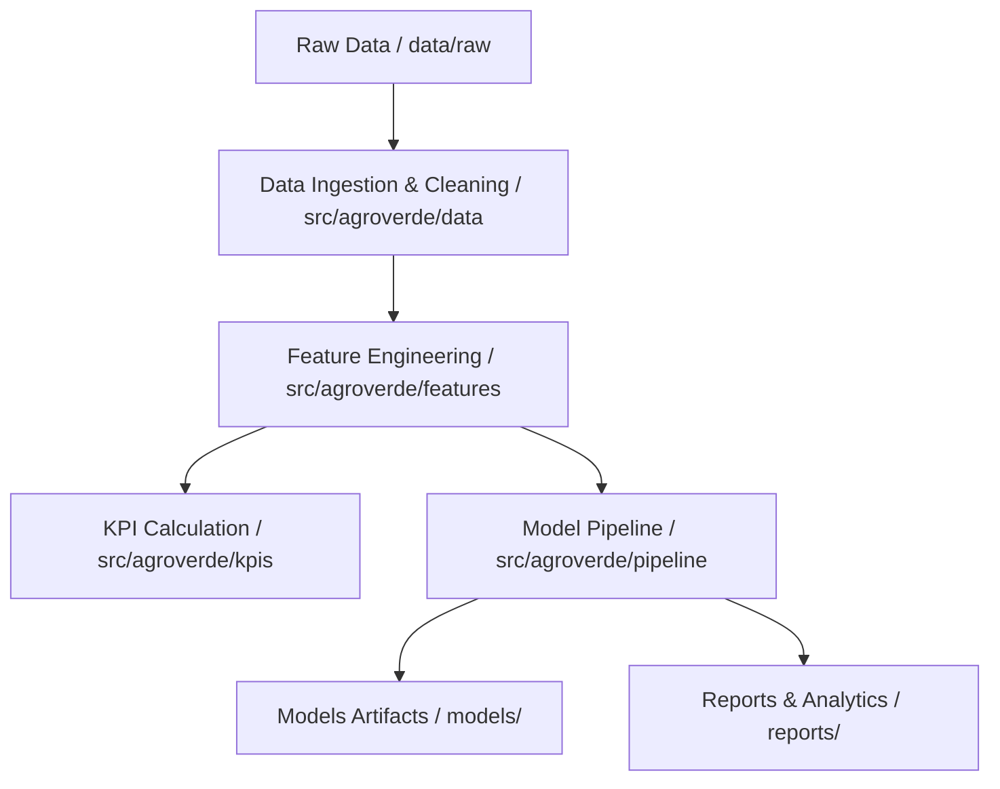

# Arquitectura del Sistema AgroVerde

## Descripción General
El proyecto **AgroVerde Data Mining** sigue una arquitectura modular y limpia orientada a la ciencia de datos y minería de datos agrícolas.

## Estructura de Capas
1. **data/**: Almacenamiento segregado por etapas del ciclo de vida del dato (raw, interim, processed, external).
2. **src/agroverde/**:
   - **config/**: Variables de entorno, constantes y rutas globales.
   - **data/**: Clases para carga, limpieza, validación y transformación.
   - **kpis/**: Módulos de lógica agronómica para indicadores clave.
   - **analysis/**: Análisis descriptivo, correlación y detección de atípicos.
   - **features/**: Selección e ingeniería de atributos.
   - **models/**: Algoritmos de clasificación, regresión y clustering.
   - **pipeline/**: Orquestadores de flujo completo.
   - **utils/**: Logging, I/O y funciones auxiliares.
